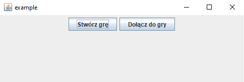
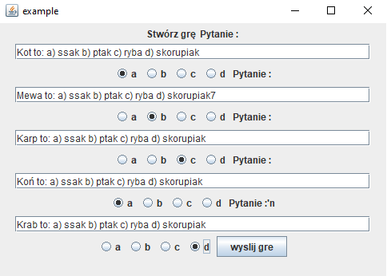
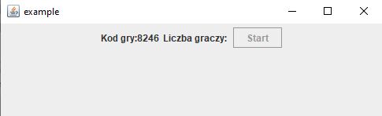
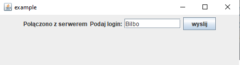
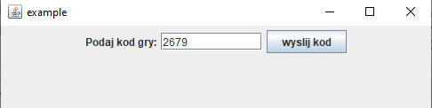
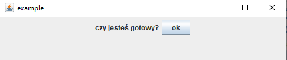
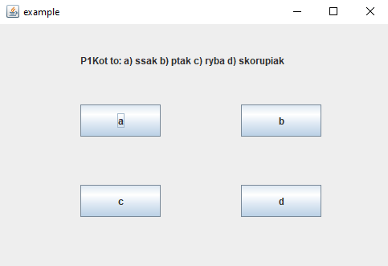

# Kahoot
* [PL](#PL)
* [ENG](#ENG)

## PL

## Spis treści
* [Informacje ogólne](#Informacje-ogólne)
* [Wykorzystane technologie](#Wykorzystane-technologie)
* [Konfiguracja](#Konfiguracja)
* [Użycie](#Użycie)
* [Potencjalny rozwój na przyszłość](#Potencjalny-rozwój-na-przyszłość)

## Informacje ogólne
Projekt ten skupia się na stworzeniu serwera oraz klienta do gry w quizzy. Pozwalają one tworzyć nowe gry lub dołączać do istniejących, podobnie jak popularna platforma Kahoot.

## Wykorzystane technologie
W projekcie komunikacja klient-serwer odbywa się z wykorzystaniem protokołu TCP. Do obsługi wejścia oraz wyjścia została wykorzystana funkcja *epoll*.

## Konfiguracja
### Serwer
Do zbudowania oraz uruchomienia serwera potrzebne jest wykonanie kilku komend. Najpierw należy otworzyć terminal w [katalogu serwera](./projekt-serwer) a następnie kolejno wykonać poniższe komendy:

- Utworz katalog *build*:
  
  `mkdir build`
  
- Przejdź do nowo stworzonego katalogu:
  
  `cd build`
  
- Skonfiguruj projekt za pomocą CMake:

  `cmake ..`

- Skompiluj projekt:

  `cmake --build`

- **Uruchom serwer:**

  `./serwer`

## Użycie
### Tworzenie nowego quizu
Użytkownik uruchamiając grę może wybrac jedną z dwóch opcji, które pokażą mu się na ekranie. 

Jeśli użytkownik wybierze opcję *Stwórz grę*, otworzy mu się formularz, w którym może wpisać swoje pytania z odpowiedziami oraz zaznaczyć, która odpowiedź jest poprawna. Następnie powinien kliknąć przycisk *wyślij grę*.

Po stworzeniu gry użytkownikowi wyświetli się Kod gry, który został przydzielony do jego quizzu oraz liczba graczy, która dołączyła do gry. Osoba odpowiedzialna za stworzenie gry może uruchomić quizz klikając przycisk *Start*.

### Dołączanie do quizu
Drugą opcją, któa jest dostępna dla użytkownika po uruchomieniu aplikacji jest dołączenie do już istniejącego quizzu. Po wybraniu opcji *Dołącz do gry*, gracz musi wpisać dowolnie wybrany login (jeśli dany login już istnieje gracz zostanie o tym poinformowany i będzie musiał wpisać inny).

Następnym krokiem jest wpisanie kodu gry do jakiej użytkownik chce dołączyć. 

Po podaniu właściwego kodu gracz może potwierdzić gotowość do gry i po rozpoczęciu quizzu przez gamemastera otrzyma pytanie wraz z możliwością zaznaczenia wybranej odpowiedzi.

Do gry można dołączyć w czasie trwania quizzu jednak wtedy za wszystkie pytania, na które inni użytkownicy już odpowiedzieli otrzyma się 0 punktów i wynik będzie liczony od pierwszego otrzymanego pytania po dołączniu.
Na koniec gry wyświetlany jest ranking (zgodnie z kolejnością dołączania do gry), który zawiera nazwy graczy, którzy brali udział w quizzie oraz otrzymane przez nich punkty.

## Potencjalny rozwój na przyszłość
Jako dalszy rozwój projektu można by uwzględnić możliwość tworzenia quizzów z różną liczbą pytań.

---------------------------------------------------------------------------------------------------------------------------
## ENG

## Table of Contents
* [General Info](#general-information)
* [Technologies Used](#technologies)
* [Setup](#setup)
* [Usage](#usage)
* [Room for Improvement](#room-for-improvement)

## General Information
This project focuses on creating a server and client for quiz games. They allow users to create new games or join existing ones, similarly to the popular platform Kahoot.

## Technologies
In the project, client-server communication is done using the TCP protocol. The epoll function is utilized for handling input and output.

## Setup
### Server
To build and run the server, you need to execute a series of commands. First, open the terminal in the [server directory](./projekt-serwer) and then follow the commands below:

- Create the *build* directory:
  
  `mkdir build`
  
- Navigate to the newly created directory:
  
  `cd build`
  
- Configure the project using CMake:

  `cmake ..`

- Compile the project:

  `cmake --build`

- **Run the server:**

  `./serwer`

## Usage
### Creating new quizz
When a user starts the game, they can choose one of two options displayed on the screen.

If the user selects the *Stwórz grę* option, a form will open where they can enter their questions with answers and mark the correct one. Then, they should click the *wyślij grę* button.

After creating the game, the user will see the game code assigned to their quiz and the number of players who have joined. The person responsible for creating the game can start the quiz by clicking the *Start* button.

### Joining quizz
The second option available to users after launching the application is to join an existing quiz. After choosing the *Dołącz do gry* option, the player must enter any chosen login (if the login already exists, the player will be informed and must enter a different one).

The next step is to enter the game code to which the user wants to join.

After providing the correct code, the player can confirm readiness to play and, when the quiz starts by the game master, receive a question with the option to select the chosen answer.

Players can join the game during the quiz; however, for all questions that others have already answered, they will receive 0 points, and the score will be calculated from the first question received after joining.
At the end of the game, a ranking is displayed (in the order of joining the game), including the names of players who participated in the quiz and the points they received.

## Room for Improvement
As a further development of the project, it would be possible to include the option to create quizzes with a various number of questions.
